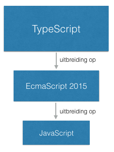

## TypeScript

TypeScript is een programmeertaal. Je kunt er webapplicaties mee schrijven, net als met JavaScript. Maar TypeScript is
een rijkere taal dan JavaScript, met meer mogelijkheden om je uit te drukken.

TypeScript is een uitbreiding op JavaScript. Dat betekent dat code die je in JavaScript geschreven hebt, automatisch ook 
geldig is in TypeScript. Andersom is niet alle TypeScript-code automatisch ook geldig in JavaScript.

Angular maakt veelvuldig gebruik van de extra mogelijkheden van TypeScript. Het is mogelijk om Angular-applicaties 
zonder TypeScript te schrijven, maar dat is veel lastiger dan met TypeScript. Sommige Java- en .NET-ontwikkelaars 
vinden JavaScript lastig. Voor hen wordt met TypeScript de stap naar front-end-ontwikkeling kleiner.

### EcmaScript 2015

Veel van de uitbreidingen die we in deze tutorial behandelen, zijn niet ge&iuml;ntroduceerd in TypeScript, maar al in
een nieuwe versie van JavaScript. 

De meeste browsers draaien JavaScript 5. Maar in 2015 is een nieuwe versie van de
JavaScript-standaard uitgekomen, waarin veel dingen zijn toegevoegd. De offici&euml;le naam van deze standaard is 
EcmaScript 2015. Hij wordt ook wel EcmaScript 6 genoemd, of kort ES6.

ES2015 is de opvolger van EcmaScript 5. Alle bestaande JavaScript-code is ook geldig in ES2015. Op zijn beurt is 
TypeScript weer een uitbreiding op ES2015. 

Tegenwoordig komen er jaarlijks nieuwe versies van de EcmaScript-standaard. 
Er bestaat ook al een ES2016. De verschillen tussen deze jaarlijkse versies zijn echter niet zo groot.

Om Angular-applicaties te kunnen schrijven hoef je niet te weten welke uitbreidingen uit ES2015 komen en welke uit 
TypeScript. Als je het wel interessant vindt om dat te weten, is [hier](http://es6-features.org/) een overzicht van de
nieuwe features in ES2015.

De belangrijkste feature die TypeScript aan ES2015 toevoegt is 
[strong typing](https://en.wikipedia.org/wiki/Type_safety). Maar ook 
[interfaces](https://www.typescriptlang.org/docs/handbook/interfaces.html) en 
[decorators](https://www.typescriptlang.org/docs/handbook/decorators.html) zijn van belang om met Angular te kunnen 
programmeren. We zullen deze features in de volgende hoofdstukken dan ook een voor een uitleggen. 
